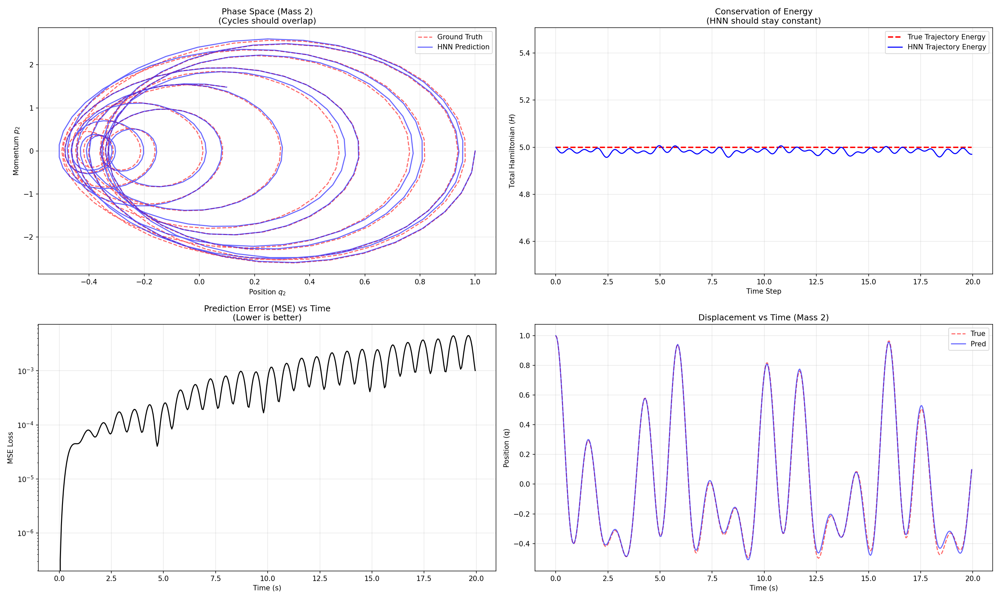
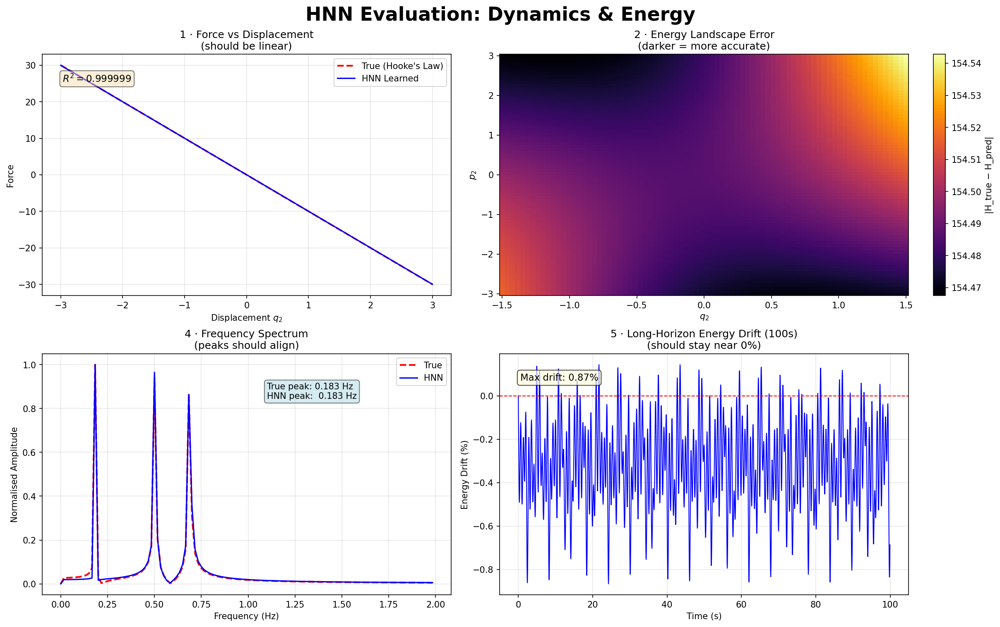
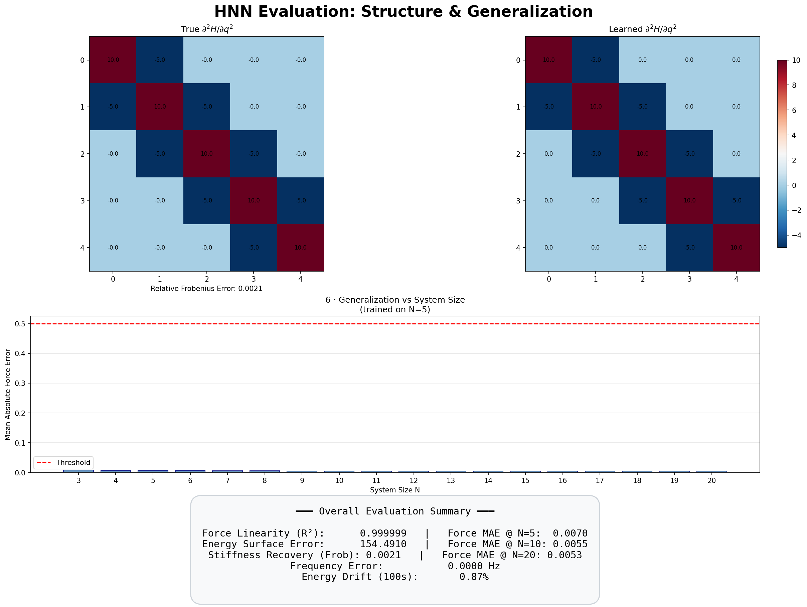

# Hamiltonian Neural Networks for Coupled Oscillators

A physics-informed deep learning project that learns the energy function of a coupled spring-mass system from data — then uses it to simulate dynamics, conserve energy, and generalise to unseen system sizes.

<p align="center">
  
</p>

## Overview

Instead of predicting trajectories directly, this network learns a single scalar — the **Hamiltonian** (total energy) — and derives all dynamics from it via automatic differentiation. This structural choice guarantees near-exact energy conservation by construction, unlike standard neural ODE or PINN approaches.

**The physical system:**

```
Wall ─/\/\/─ [m₀] ─/\/\/─ [m₁] ─/\/\/─ [m₂] ─/\/\/─ [m₃] ─/\/\/─ [m₄] ─/\/\/─ Wall
```

Five identical masses connected by identical springs with fixed boundary conditions. The network observes position and momentum data, learns the energy landscape, and recovers Hamilton's equations of motion.

## Key Results

| Metric | Value |
|---|---|
| Force linearity (R²) | 0.999999 |
| Stiffness matrix recovery (Frobenius error) | 0.0021 |
| Dominant frequency error | 0.0000 Hz |
| Energy drift (100s rollout) | 0.87% |
| Generalisation (trained N=5, tested N=20) | MAE < 0.01 |

The model recovers the exact tridiagonal coupling matrix from the learned Hessian, matches all normal mode frequencies, and generalises to chain lengths 4× longer than training data.

<p align="center">
  
  
</p>

## Architecture

The network uses **1D convolutions** rather than fully-connected layers. This is a deliberate architectural choice: springs couple only nearest neighbours, and a Conv1d kernel of size 3 naturally captures exactly this local interaction pattern.

```
Input: [q₀, q₁, ..., q₄, p₀, p₁, ..., p₄]   (10,)
                    ↓ reshape
         (2 channels × 5 positions)
                    ↓ Conv1d(2→32, kernel=3) + GCU
                    ↓ Conv1d(32→32, kernel=1) + GCU
                    ↓ Conv1d(32→1, kernel=1)
         [e₀, e₁, e₂, e₃, e₄]  ← local energy per mass
                    ↓ sum
                 scalar H
```

The **Growing Cosine Unit** (GCU) activation `f(z) = z·cos(z)` is used instead of ReLU because physics requires smooth, non-zero higher-order derivatives — the Hessian of the learned energy must recover the spring coupling matrix.

## Project Structure

```
├── coupled_masses.py              # Data generation: parallel ODE solver
├── HNN_eval.py                    # Training script: ConvHNN + loss function
├── plot_HNN.py                    # Evaluation: trajectory rollouts + energy plots
├── coupled_oscillator_data.npz    # Generated training data (200k samples)
├── model_weights.eqx              # Trained model weights (Equinox format)
├── hnn_evaluation_metrics.png     # 4-panel evaluation dashboard
├── hnn_eval_part1_dynamics.png    # Phase space, energy, MSE, displacement
├── hnn_eval_part2_structure.png   # Force curve, Hessian, frequencies, drift
├── requirements.txt
└── README.md
```

## Quick Start

### 1. Install dependencies

```bash
pip install -r requirements.txt
```

### 2. Generate training data

```bash
python coupled_masses.py
```

This runs 100 parallel ODE simulations with random initial conditions using JAX's `vmap` and the Tsit5 solver. Produces `coupled_oscillator_data.npz` containing 200,000 state snapshots.

### 3. Train the HNN

```bash
python HNN_eval.py
```

Trains for 50 epochs (~5 minutes on CPU). The loss function compares the network's predicted dynamics (gradients of learned H) against the true dynamics (p/m and k·A·q). Saves weights to `model_weights.eqx`.

### 4. Evaluate

```bash
python plot_HNN.py
```

Generates evaluation plots: phase space trajectories, energy conservation, prediction error, and displacement comparison against ground truth.

## How It Works

### Training

The network never sees trajectories during training. Instead, at each step it:

1. Takes a batch of states `(q, p)` from the training data
2. Computes `H = network(q, p)` — a scalar energy prediction
3. Differentiates H to get predicted dynamics: `dq/dt = ∂H/∂p`, `dp/dt = -∂H/∂q`
4. Compares against true dynamics: `dq/dt = p/m`, `dp/dt = k·A·q`
5. Updates weights to minimise the mismatch

### Inference

To simulate a new scenario:

1. Choose any initial condition `(q₀, p₀)` — no retraining needed
2. Feed the state to the network, get `H`
3. Use `jax.grad(H)` to compute Hamilton's equations
4. Pass these to an ODE solver (Tsit5) which steps forward in time
5. The solver conserves the learned energy surface by construction

### Why Not a PINN?

This project deliberately uses an HNN over a Physics-Informed Neural Network. The key differences:

| | HNN (this project) | PINN |
|---|---|---|
| Learns | Energy landscape (scalar) | Solution trajectory q(t) |
| Energy conservation | Structural (exact) | Soft penalty (approximate) |
| New initial conditions | No retraining | Full retraining |
| Autograd cost per step | O(1) — one scalar gradient | O(N) — N second derivatives |
| Spectral bias | Not applicable (no oscillatory output) | Misses high-frequency modes |

## Physics Background

The system is governed by the Hamiltonian:

```
H(q, p) = Σᵢ pᵢ²/(2m) + (1/2)·k·qᵀ·(-A)·q
```

where `A` is the tridiagonal coupling matrix encoding nearest-neighbour spring connections. Hamilton's equations give the time evolution:

```
dqᵢ/dt =  ∂H/∂pᵢ = pᵢ/m          (velocity)
dpᵢ/dt = -∂H/∂qᵢ = k·(A·q)ᵢ      (force)
```

The coupling matrix for N=5 with fixed boundaries:

```
A = [ -2   1   0   0   0 ]
    [  1  -2   1   0   0 ]
    [  0   1  -2   1   0 ]
    [  0   0   1  -2   1 ]
    [  0   0   0   1  -2 ]
```

## Tech Stack

- **[JAX](https://github.com/google/jax)** — Automatic differentiation and JIT compilation
- **[Equinox](https://github.com/patrick-kidger/equinox)** — Neural network library built on JAX
- **[Diffrax](https://github.com/patrick-kidger/diffrax)** — ODE solvers for JAX
- **[Optax](https://github.com/deepmind/optax)** — Gradient-based optimisation

## References

- Greydanus, S., Dzamba, M., & Sosanya, J. (2019). [Hamiltonian Neural Networks](https://arxiv.org/abs/1906.01563). NeurIPS.
- Cranmer, M., Greydanus, S., et al. (2020). [Lagrangian Neural Networks](https://arxiv.org/abs/2003.04630). ICLR Workshop.
- Zhong, Y. D., et al. (2020). [Symplectic ODE-Net](https://arxiv.org/abs/1909.12077). ICLR.

## License

MIT